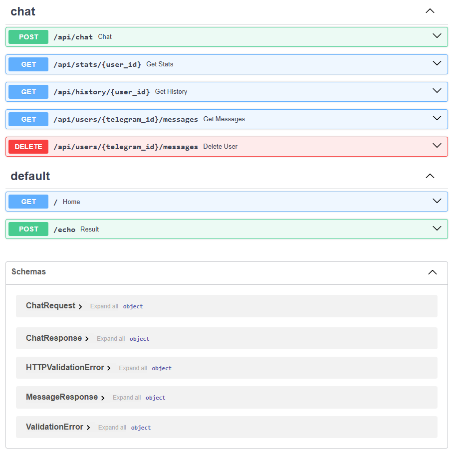

# AI Telegram Bot Backend

Backend для Telegram AI-бота с памятью сообщений, REST API и PostgreSQL.

---

## Features

- Telegram AI bot
- OpenAI integration
- Conversation memory
- PostgreSQL database
- REST API
- FastAPI
- SQLAlchemy ORM
- Docker support
- Render deploy
- API authentication
- Logging middleware
- Global exception handling

---

## Tech Stack

- Python
- FastAPI
- SQLAlchemy
- PostgreSQL
- Alembic
- Docker
- OpenAI API
- Render
- Pydantic

---

## Architecture

```text
Telegram
↓
FastAPI
↓
Services
↓
Repository
↓
SQLAlchemy ORM
↓
PostgreSQL
```

---

## API Endpoints

### Chat

```http
POST /api/chat
```

### User History

```http
GET /api/history/{user_id}
```

### User Statistics

```http
GET /api/stats/{user_id}
```

### User Messages

```http
GET /api/users/{telegram_id}/messages
```

### Delete User Messages

```http
DELETE /api/users/{telegram_id}/messages
```

---

## Environment Variables

Создайте `.env` файл:

```env
OPENAI_API_KEY=
BOT_TOKEN=
DATABASE_URL=
SECRET_KEY=
MEMORY_LIMIT=
OPENAI_MODEL=
```

---

## Run Locally

### Clone repository

```bash
git clone https://github.com/tutubalinandrew-coder/ai-telegram-bot
```

### Install dependencies

```bash
pip install -r requirements.txt
```

### Run FastAPI

```bash
python -m uvicorn api:app --reload
```

### Open Swagger Docs

```text
http://127.0.0.1:8000/docs
```

---

## Docker

### Run project

```bash
docker compose up --build
```

---

## Database Migrations

### Create migration

```bash
python -m alembic revision --autogenerate -m "migration name"
```

### Apply migrations

```bash
python -m alembic upgrade head
```

---

## Logging

Проект использует middleware для:

- request logging
- response status logging
- request timing
- global exception handling

---

## Security

API защищён через:

```text
X-API-Key
```

---

## Swagger Docs

FastAPI автоматически генерирует Swagger UI для тестирования API.


```text
http://127.0.0.1:8000/docs
```

---

## Deploy

Проект задеплоен на Render.

---

## Author

Andrew Tutubalin


